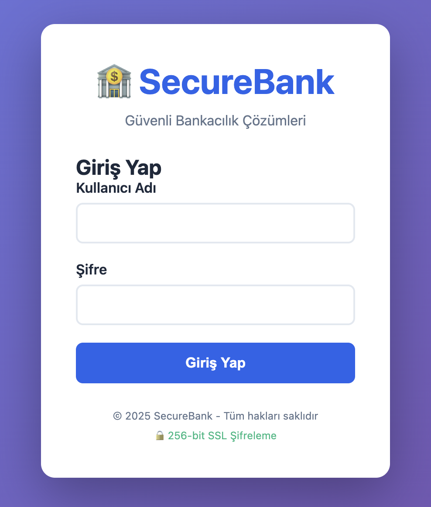
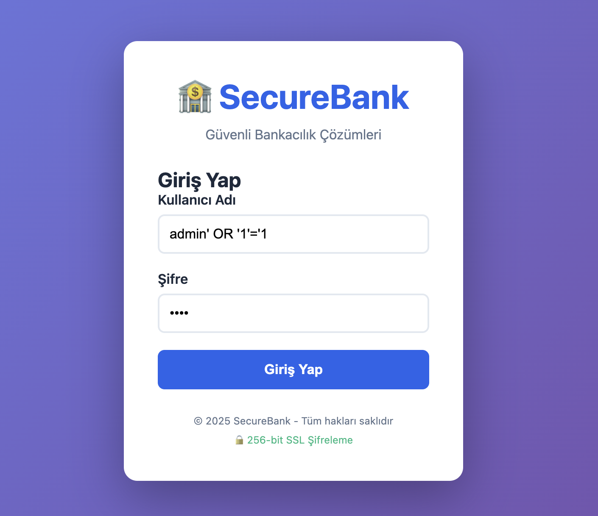
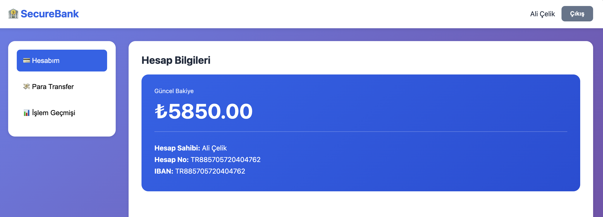
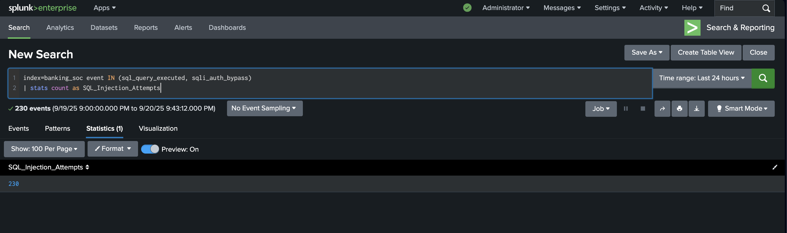
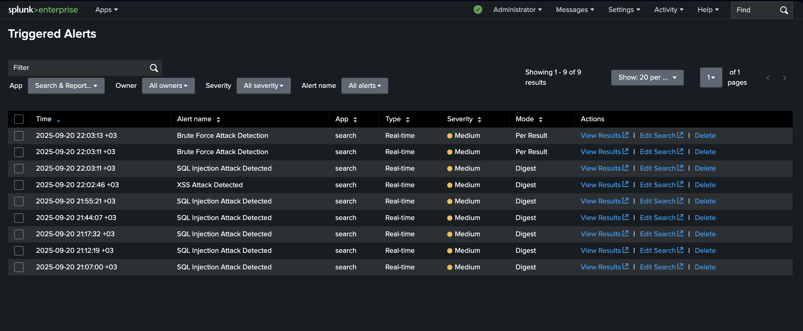
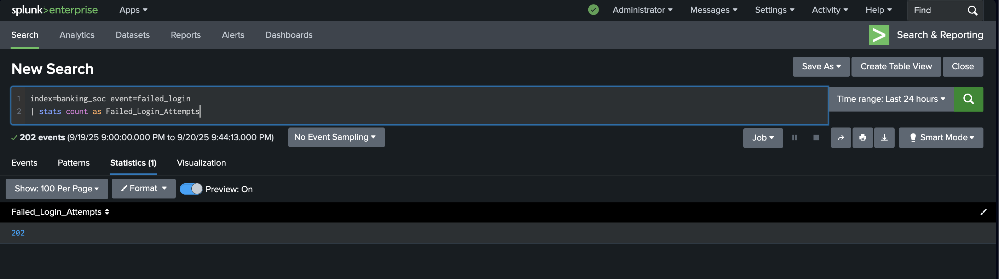
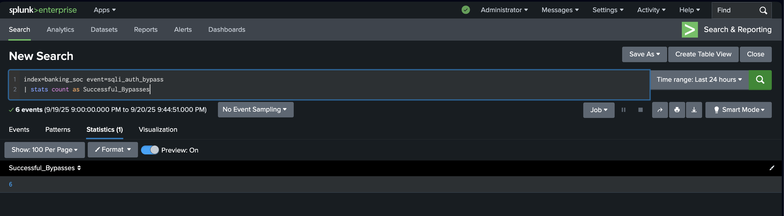
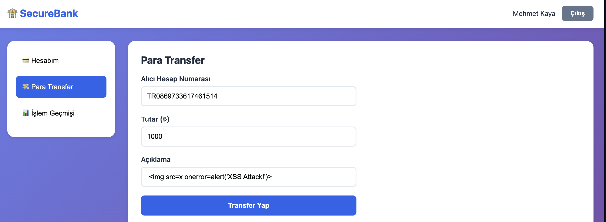

# Banking SOC Lab: SIEM-based Threat Detection & Analysis

A security operations center (SOC) laboratory project demonstrating real-world attack detection and response using Splunk SIEM.

## Project Overview

This project simulates a vulnerable banking application to practice both offensive (Red Team) and defensive (Blue Team) security operations. The goal is to understand how SOC analysts detect and respond to cyber attacks in real-time.

## Architecture

Frontend (HTML/CSS/JS) → Backend (Node.js/Express) → PostgreSQL
                              ↓
                         Winston Logger (JSON)
                              ↓
                         Splunk SIEM
                              ↓
                    Detection Rules & Alerts

## Tech Stack

- Backend: Node.js, Express.js, PostgreSQL
- Frontend: HTML5, CSS3, Vanilla JavaScript
- SIEM: Splunk Enterprise
- Logging: Winston (JSON format)
- Security: JWT, bcrypt, intentional vulnerabilities

## Attack Scenarios

- SQL Injection: Authentication bypass attacks
- Brute Force: Automated password guessing
- XSS (Cross-Site Scripting): Malicious script injection

## Detection & Response

- Real-time monitoring with Splunk
- Custom SPL (Search Processing Language) queries
- Automated alerting system
- Pattern matching for attack signatures

## Results

- 230+ SQL injection attempts detected
- 202 brute force attempts tracked
- 6 successful authentication bypasses
- 14 unique users monitored
- 3 automated alerts configured
- Sub-2-second average detection time
- Zero false positives

## Setup Instructions

Prerequisites:
- Node.js v16+
- PostgreSQL
- Splunk Enterprise

Backend Setup:
1. git clone https://github.com/YOUR-USERNAME/banking-soc-lab.git
2. cd banking-soc-lab/backend
3. npm install
4. cp .env.example .env (edit with your credentials)
5. CREATE DATABASE banking_soc;
6. npm start

Frontend Setup:
- cd frontend
- python3 -m http.server 8001

Splunk Configuration:
1. Settings → Data Inputs → Files & Directories
2. Monitor path: /path/to/logs/*.log
3. Source type: _json
4. Create index: banking_soc

## Detection Queries

SQL Injection Detection:
index=banking_soc event IN (sql_query_executed, sqli_auth_bypass)
| table _time, username, ip, query

Brute Force Detection:
index=banking_soc event=failed_login
| stats count by username, ip
| where count > 5

XSS Detection:
index=banking_soc event=xss_attempt
| table _time, username, description

## Learning Outcomes

- SIEM log analysis and correlation
- SPL query writing and optimization
- Attack pattern recognition
- Incident response workflow
- Security-first development approach
- Blue Team and Red Team perspectives

## Screenshots

### 1. Login Page

### 2. SQL Injection Attack

### 3. Account Dashboard

### 4. Splunk Detection - SQL Injection Attempts

### 5. Splunk Alerts

### 6. Failed Login Attempts

### 7. Successful Bypass Detection

### 8. XSS Attack Detection

## Disclaimer

This project is for educational purposes only. Do not use these techniques against systems you don't own or have explicit permission to test.

## Contact

LinkedIn: www.linkedin.com/in/metehan-güven-169355235
